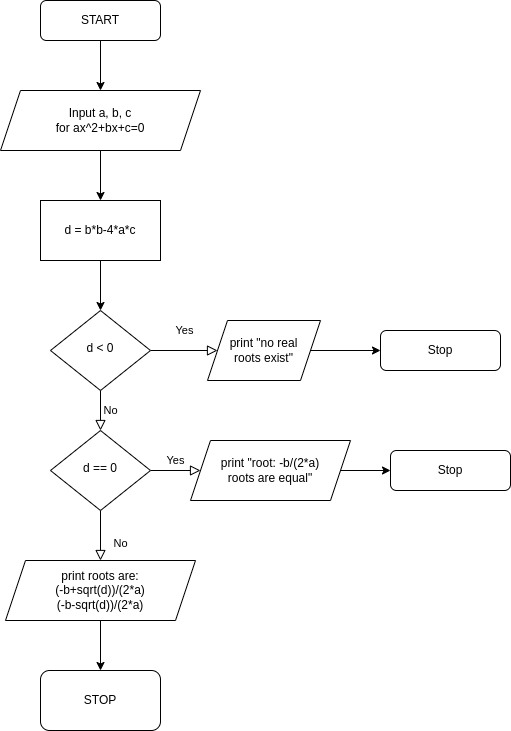

# Roots of a quadratic equation

## Algorithm

```
1. START
2. INPUT a, b, c FOR ax^2 + bx + c = 0
3. d = b*b - 4*a*c
4. IF d < 0 THEN
        PRINT no real roots exist
   ELSE IF d == 0 THEN
        PRINT root = -b/(2*a). Roots are equal
   ELSE
        PRINT root1 = (-b + sqrt(d)) / (2*a)
              root2 = (-b - sqrt(d)) / (2*a)
5. STOP
```

## Flowchart

