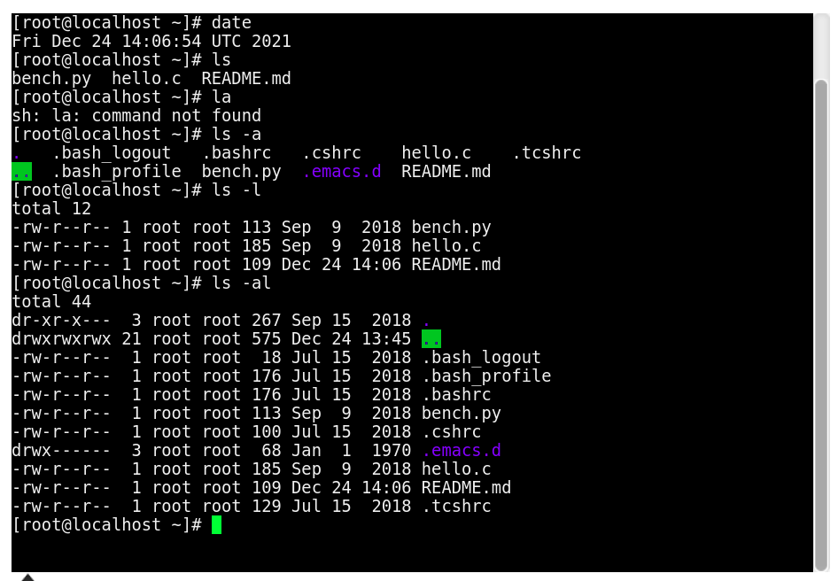
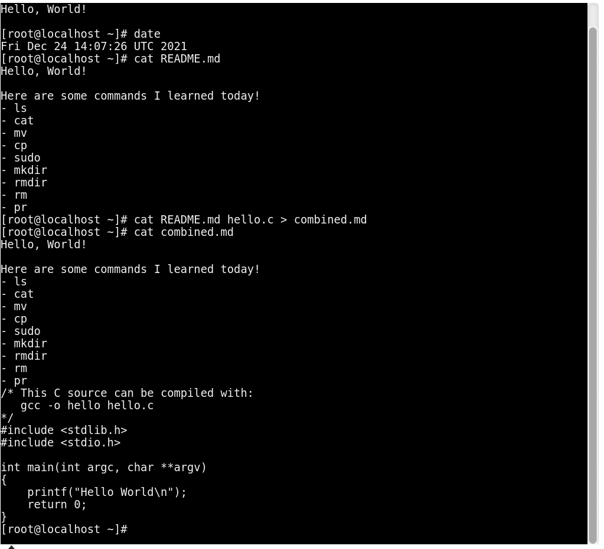
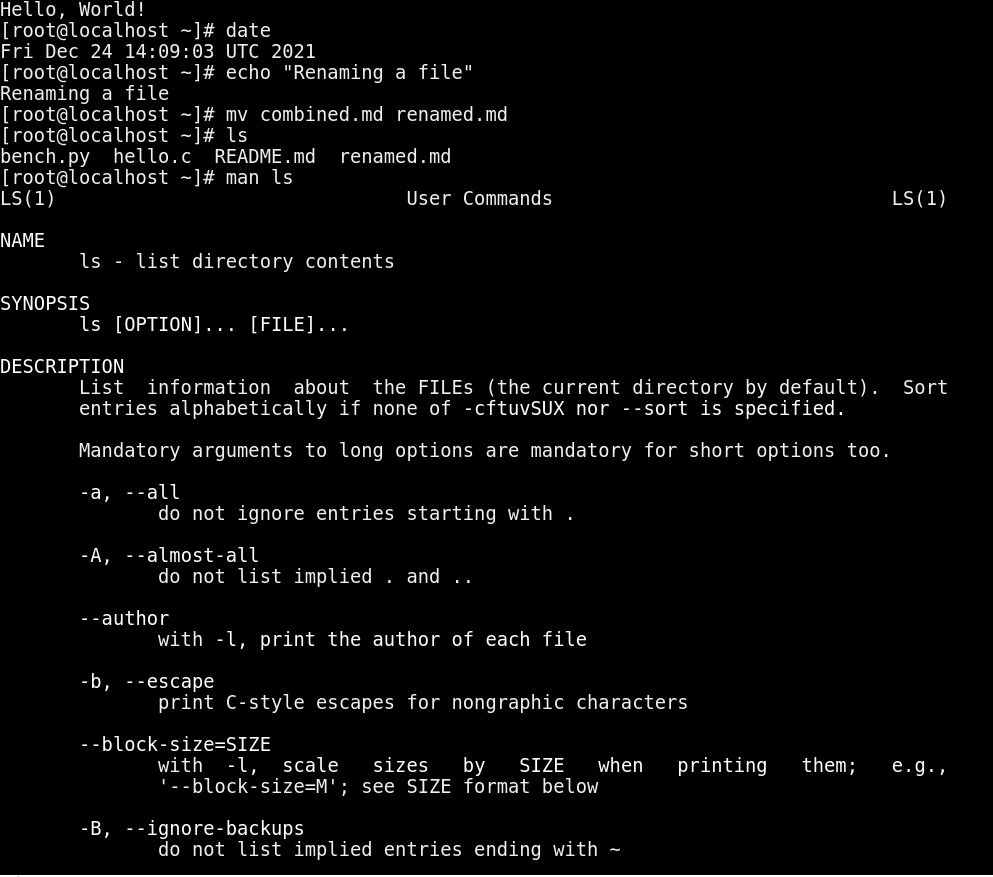
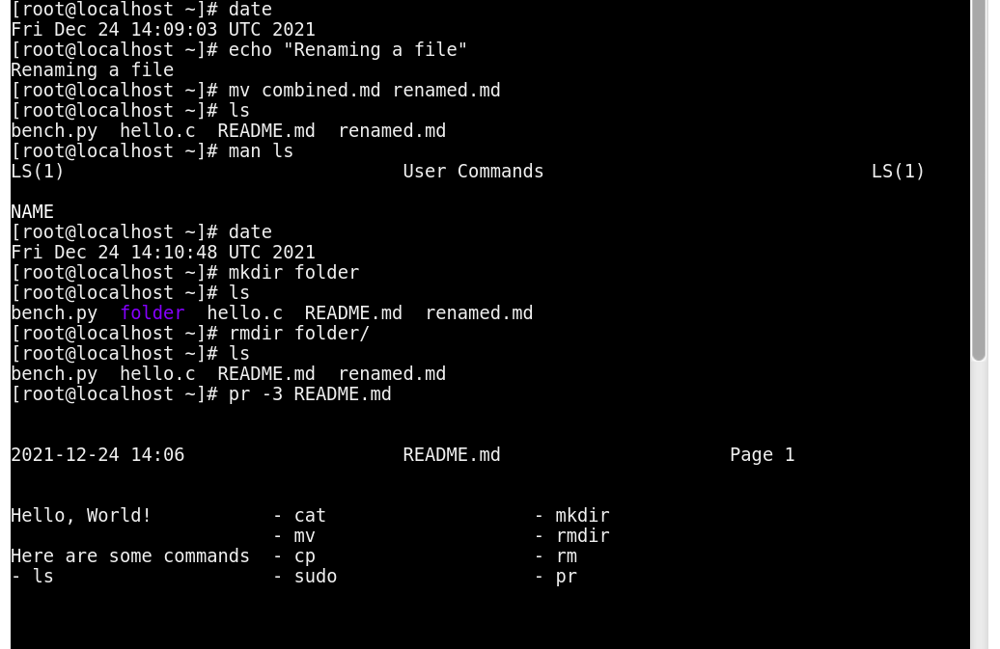
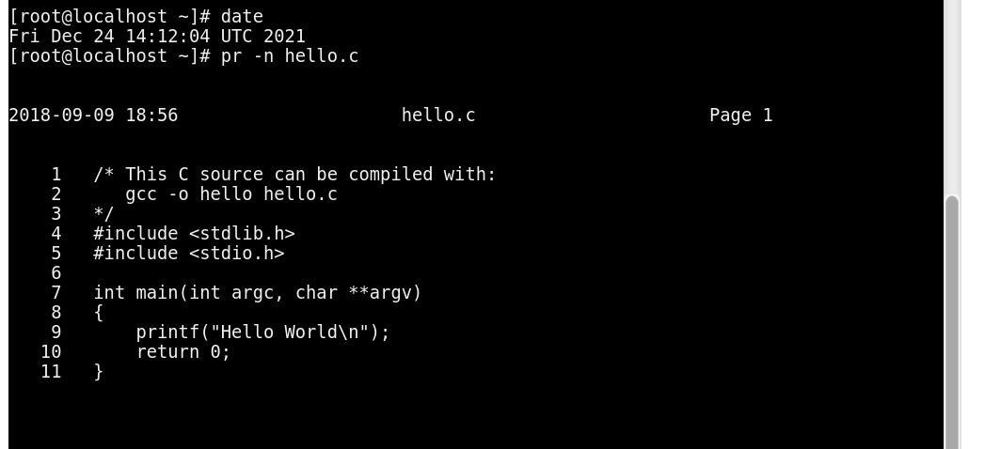
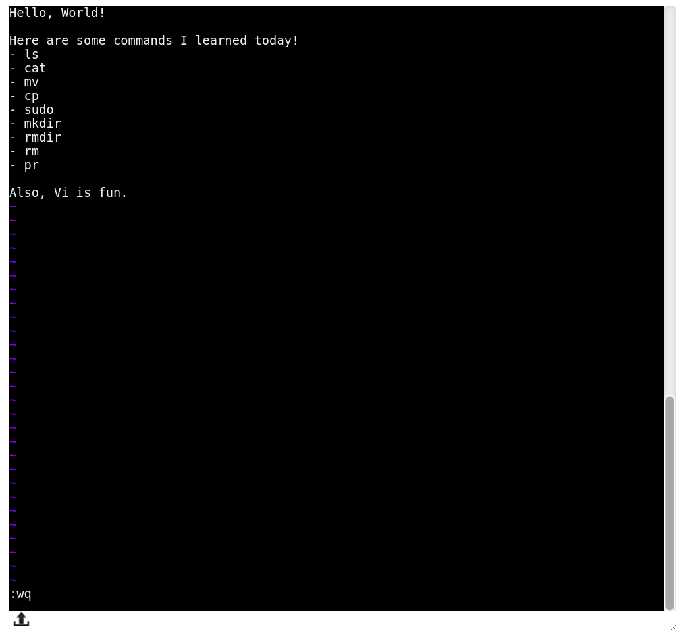
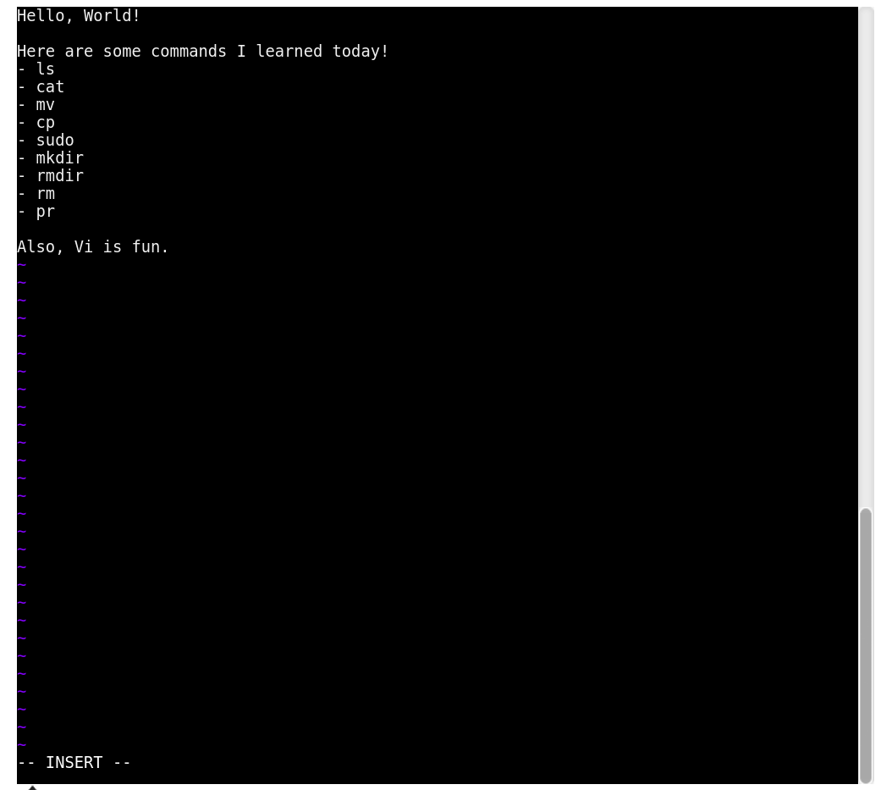

# Basic Linux Commands

Today I learned the following commands:

- ls
- dir
- cat   
- mv
- mkdir
- rmdir
- rm
- man

Here are some screenshots:

---

# VI Editor

Today I learned about some commands in vim and difference between normal and insert mode.

